In a Google Chrome browser, navigate to the Crumble software download page [redfernelectronics.co.uk/crumble-software](https://redfernelectronics.co.uk/crumble-software/):

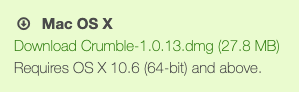

Click on the **Mac OS X** download image.

--- no-print ---

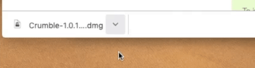

--- /no-print ---

--- print-only ---

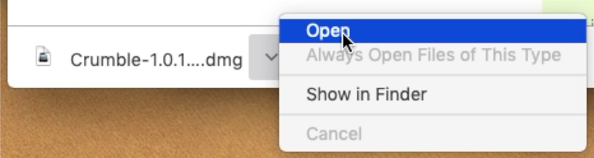

--- /print-only ---

In the bottom left-hand corner of the page, in the file download tab, click on the upward arrow. Then click on **Open**.

--- no-print ---

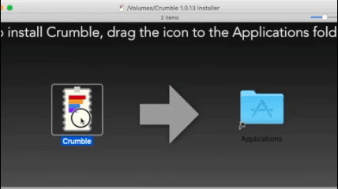

--- /no-print ---

--- print-only ---

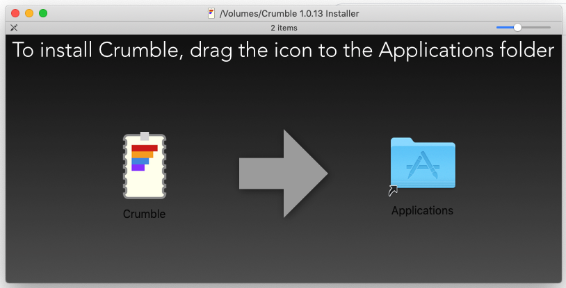

--- /print-only ---

A window opens and prompts you to drag the Crumble program file into the Applications folder.

A pop-up may appear to tell you that Crumble cannot be opened because the developer cannot be confirmed. If this happens, click on **OK**.

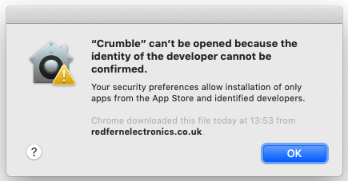

Now open your Mac's settings: click on the Apple symbol in the top left-hand corner, and then click on **System Preferences**.

In the System Preferences menu, click on **Security & Privacy**.

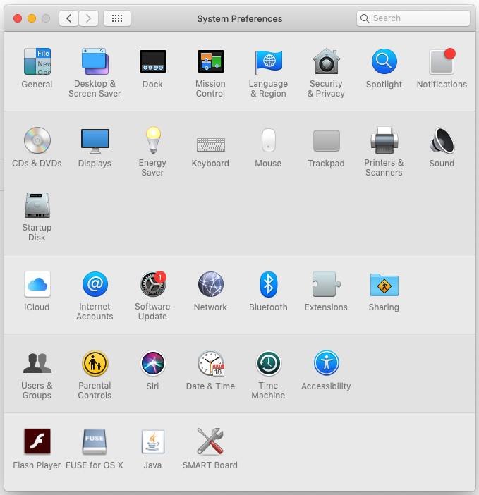

In the **Security General** tab, click on the padlock symbol in the bottom left-hand corner.

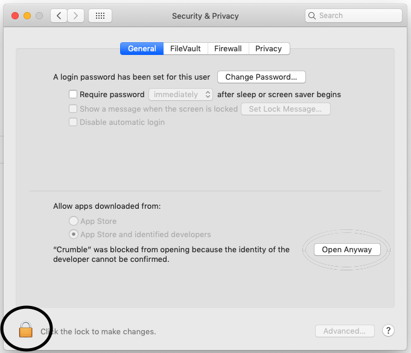

Enter the system password for the Mac you are using. If you don't know the password, ask the owner of the computer or perhaps the network administrator about it.

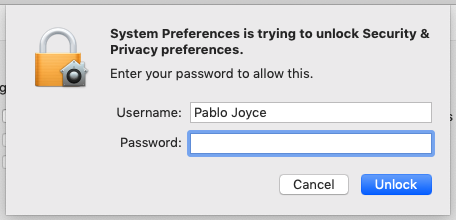

Once the system password is entered, click on the **Open Anyway** button.

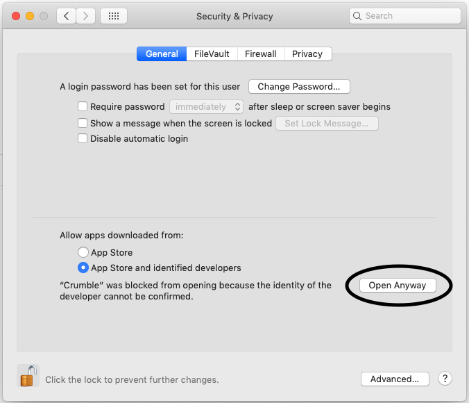

Now you can start the Crumble software by clicking on the **Open** button.

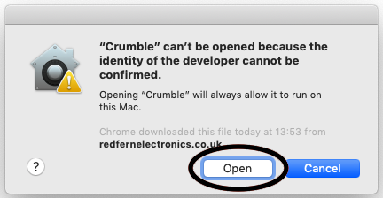

In future, the Crumble software should open without the need for any security checks.
