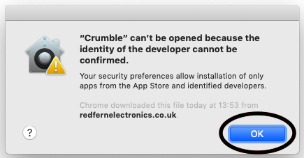
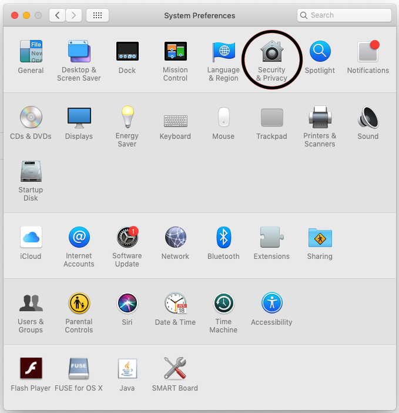

--- task ---

In a Google Chrome web browser window, navigate to the Crumble software download page, https://redfernelectronics.co.uk/crumble-software/.

Click on the Mac OS X download image.

--- no-print ---

--- /no-print ---

--- print-only ---

--- /print-only ---

At the bottom left of the page in the file download tab, click on the upward arrow and choose open.

--- no-print ---

--- /no-print ---

--- print-only ---

--- /print-only ---

A window will open prompting you to drag the Crumble program file into the Applications folder.

Depending on your Mac's security settings, you may get a pop up window saying that Crumble cannot be opened because the developer cannot be confirmed. If this happens, Click OK.

Now open your Mac's Settings (you can open settings in many ways including clicking on the Apple symbol in the top left corner and choosing System Preferences...)

In Settings, choose Security & Privacy.

In the Security General tab we will need click the Open Anyway button, but first we need to unlock the security settings. Click on the padlock symbol in the bottom left of the window.

Enter the system password for the Mac you are using. If it is not your machine, you will need to ask the owner or perhaps the network administrator.

Once unlocked, click on the Open Anyway button.

Finally, click the Open button and the Crumble software should now open. In future, the Crumble software should open without the need for any security checks.

--- /task ---