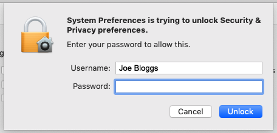

## Installing Crumble software on Mac OS X

--- task ---

In a Google Chrome web browser window, navigate to the Crumble software download page, https://redfernelectronics.co.uk/crumble-software/.

Click on the Mac OS X download image.

At the bottom left of the page in the file download tab, click on the upward arrow and choose open.

--- no-print ---

--- /no-print ---

--- print-only ---

--- /print-only ---

A window will open prompting you to drag the Crumble program file into the Applications folder.

--- no-print ---

--- /no-print ---

--- print-only ---

--- /print-only ---

--- /task ---